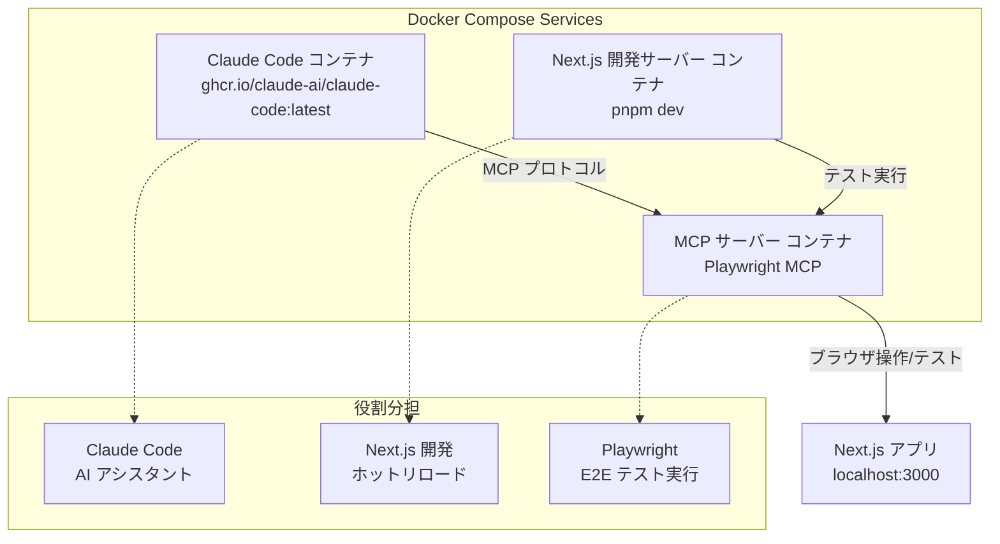

# サーバ

```mermaid
graph TD
    A[Claude Code コンテナ<br/>ghcr.io/claude-ai/claude-code:latest] -->|MCP プロトコル| C[MCP サーバー コンテナ<br/>Playwright MCP]
    B[Next.js 開発サーバー コンテナ<br/>pnpm dev] -->|テスト実行| C
    C -->|ブラウザ操作/テスト| D[Next.js アプリ<br/>localhost:3000]
    
    subgraph "Docker Compose Services"
        A
        B  
        C
    end
    
    subgraph "役割分担"
        A1[Claude Code<br/>AI アシスタント]
        B1[Next.js 開発<br/>ホットリロード]
        C1[Playwright<br/>E2E テスト実行]
    end
    
    A -.-> A1
    B -.-> B1
    C -.-> C1
```